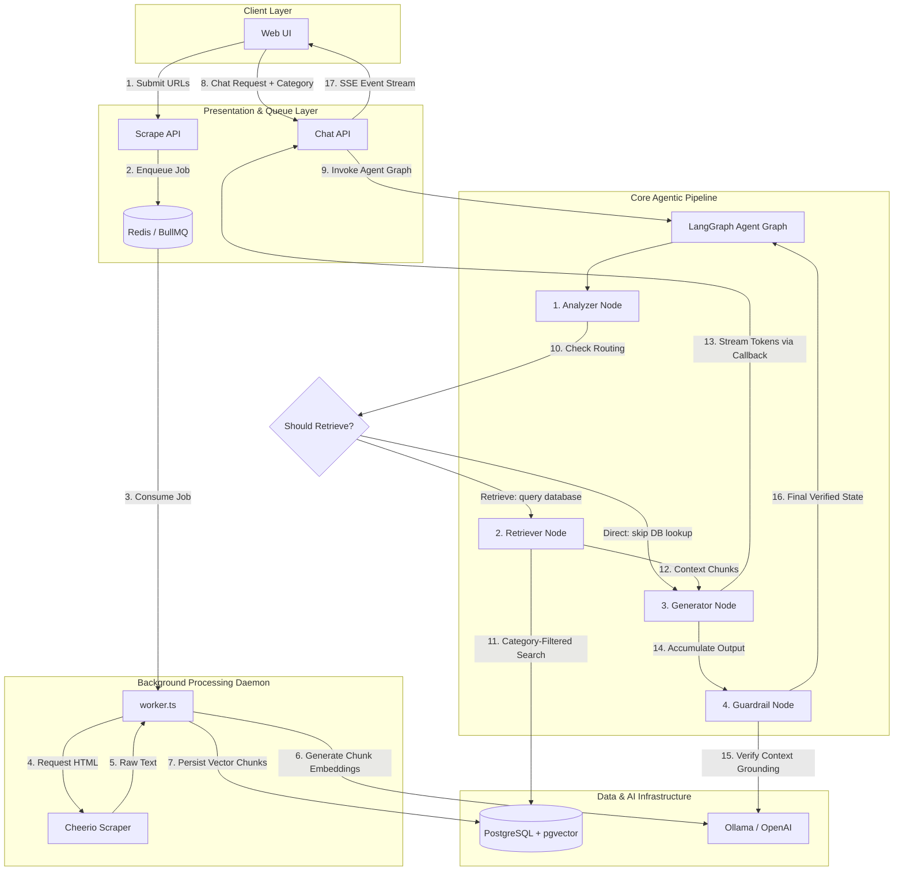

# 🧠 Scropen

**Privacy-first local RAG (Retrieval-Augmented Generation) system** — scrape any website, index it as high-dimensional vector embeddings, and chat with your data using local AI. Built using **Clean/Hexagonal Architecture (Ports & Adapters)** for complete decoupling of core business logic from framework dependencies.

> Scrape ➡️ Chunk ➡️ Embed ➡️ Store with Category ➡️ Route & Audit ➡️ SSE Stream

---

## 🏗️ System Architecture

Scropen strictly enforces dependency inversion. Core domain entities and use cases are entirely decoupled from framework layers, databases, and APIs.

```
src/
├── app/                          # Next.js 16 Web App & API Router (UI / Presentation Layer)
│   ├── page.tsx                  # Async Server Component (dashboard entrypoint)
│   ├── actions.ts                # Server Actions (revalidation triggers)
│   ├── components/               # React client/server components
│   └── api/
│       ├── scrape/route.ts       # Validates and enqueues scraping jobs to BullMQ
│       └── chat/route.ts         # SSE streaming chat endpoint
├── core/                         # Domain & Business Logic (zero external framework dependencies)
│   ├── entities/                 # Domain objects (ScrapedData, ContentCategory)
│   ├── ports/                    # Interface contracts for infrastructure boundaries
│   │   ├── llm.port.ts           # LLM generation interface
│   │   ├── embedding.port.ts     # Vector embedding interface
│   │   ├── vector-store.port.ts  # pgvector persistence & similarity query
│   │   ├── scraper.port.ts       # HTML scraper port
│   │   ├── queue.port.ts         # Asynchronous job queue port
│   │   └── category.port.ts      # Category catalog management
│   ├── use-cases/                # Orchestration of domain tasks
│   │   ├── scrape-and-index.usecase.ts
│   │   └── agentic-chat.usecase.ts
│   └── agents/                   # Agent workflow systems
│       └── chat-agent.graph.ts   # Advanced 4-node LangGraph pipeline
│   └── infrastructure/           # Concrete adapter implementations
│       ├── llm/                  # OpenAI & Local Ollama providers (answering + embeddings)
│       ├── scrapers/             # Cheerio-based static HTML content extractor
│       ├── queue/                # BullMQ background task manager
│       └── storage/              # Drizzle ORM + pgvector database + Redis
└── worker.ts                     # Independent BullMQ queue consumer daemon
```

### 🔁 Data & Processing Flow



---

## 🛠️ Tech Stack

| Component | Technology | Description |
| :--- | :--- | :--- |
| **Framework** | Next.js 16 (App Router), React 19 | Presentation layer, Server Components, and API routing. |
| **Styling** | Tailwind CSS | Sleek, custom-tailored dark dashboard with responsive grids. |
| **Database** | PostgreSQL + `pgvector` | Persistent storage with Cosine-distance vector similarity queries. |
| **Queue** | BullMQ + Redis | Background task architecture with backoff retries and daemon isolation. |
| **Agent Core** | LangGraph JS/TS (`v1.4.4`) | Custom state machines containing analyzers, routers, and QA guardrails. |
| **Local AI** | Ollama (`gemma3` & `nomic-embed-text`) | Runs locally, ensuring 100% privacy and zero subscription fees. |
| **Cloud AI** | OpenAI (`gpt-4o-mini` & `text-embedding-3-small`)| Automatic fallback when no local instance is detected. |
| **ORM** | Drizzle ORM | Type-safe migrations and SQL builder. |
| **Testing** | Vitest | Complete unit and integration test suite mock testing. |

---

## 🔍 How Category Filtering Works

When you submit a list of web links, the scraper partitions the extracted text into sentence-aware blocks, embeds each chunk, and saves it linked to a specific database **category**.

During a similarity search, Scropen filters the query space. In the database adapter (`DrizzlePgVectorAdapter`), the query searches target chunks inside PostgreSQL:

```typescript
// path: src/core/infrastructure/storage/drizzle/drizzle-pgvector.adapter.ts
async searchSimilar(embedding: number[], limit: number = 5, category?: string): Promise<ScrapedData[]> {
  const vectorString = JSON.stringify(embedding);
  const similarityExpression = sql`1 - (${siteChunksSchema.embedding} <=> ${vectorString}::vector)`;

  let query = this.db
    .select({ ...fields })
    .from(siteChunksSchema);

  // Filters similarity results strictly to the selected scope
  if (category) {
    query = query.where(eq(siteChunksSchema.category, category)) as typeof query;
  }

  return await query.orderBy(desc(similarityExpression)).limit(limit);
}
```

This prevents database searches from retrieving irrelevant data from other indexed sites.

---

## 🚀 Getting Started

### Prerequisites
- [Docker](https://docs.docker.com/get-docker/) & Docker Compose
- *Optional:* [OpenAI API Key](https://platform.openai.com/api-keys) (if using Cloud-based AI)

### Quick Start
1. Clone the project:
   ```bash
   git clone https://github.com/your-username/scropen.git
   cd scropen
   ```
2. Set up environment:
   ```bash
   cp .env.example .env
   # Add your OPENAI_API_KEY to bypass local Ollama setups.
   ```
3. Launch services:
   ```bash
   docker-compose up --build
   ```
This boots all 5 containers:
- **`scropen_db`**: Postgres database with `pgvector` extension.
- **`scropen_redis`**: Job Queue broker.
- **`scropen_ollama`**: Auto-pulls `gemma3` and `nomic-embed-text` models on start.
- **`scropen_next`**: Next.js App Router UI.
- **`scropen_worker`**: Node.js worker consuming queue tasks.

---

## 💻 Local Development

For debugging code, run services directly on your host machine:

```bash
# 1. Install dependencies
pnpm install

# 2. Spin up databases and model engines
docker-compose up vectordb redis ollama

# 3. Synchronize database tables
pnpm db:push

# 4. Start Next.js development server
pnpm dev

# 5. Start the background worker process (in a separate tab)
npx tsx worker.ts
```

---

## 🧪 Testing and Verification

Scropen utilizes [Vitest](https://vitest.dev/) for high-speed, mocking-centric unit and integration tests.

```bash
# Run all test assertions
pnpm test

# Run tests in hot-reload watch mode
pnpm test:watch

# Execute ESLint validations
pnpm lint
```

---

## 🛡️ License

Distributed under the MIT License. See `LICENSE` for more details.
